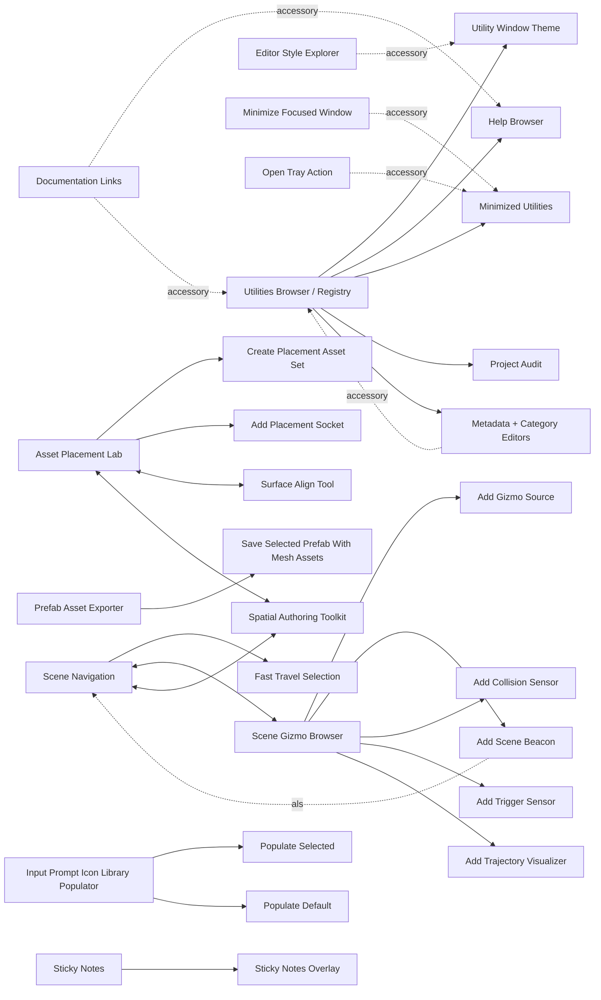
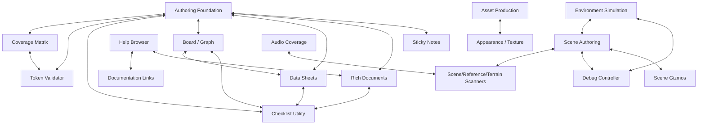

# PungentFunk Utilities Package Audit

Audit date: 2026-05-14  
Scope: `PungentFunkUtilities` package source, editor registry, package catalog, menu bootstraps, utility window source files, local `unity-editor-engineering` skill guidance, and PFU utility doctrine.

## Executive Summary

The suite is no longer a loose toolbox. It is a multi-package Unity Editor utility platform with a strong Core, several mature production tools, and a growing authoring/documentation ecosystem. The main issue is presentation architecture: many action-like, helper, setup, bridge, and developer-only systems are still exposed as browser-level utilities or registered beside core workflows. That weakens wayfinding and makes the browser feel flatter than the package architecture actually is.

Recommended direction: keep the Utilities Browser focused on standalone core workflows, move accessory actions into the relevant core utility surfaces, and expose complementary integrations as contextual cross-links rather than equal browser cards.

## Evidence Base

- Registry owner: `Editor/Utilities Core/PungentUtilityRegistry.cs`
- Package catalog owner: `Editor/Utilities Core/Packages/PungentUtilityPackageCatalog.cs`
- Self-registering utilities: `Editor/BoardGraph/PungentBoardMenuItems.cs`, `Editor/Rich Documents/PungentRichDocumentMenuItems.cs`
- Menu taxonomy: `Editor/Utilities Core/PungentUtilityMenuPaths.cs`
- Assemblies: runtime asmdef, editor asmdef, main-toolbar bridge asmdef
- Design lenses used: hierarchy, proximity, chunking, progressive disclosure, Unity Editor Engineering, Unity Interface Forensics, Unity Registry/System Atlas

## Inventory

### Package Groups

| Package | Stage | Registered utility surface |
|---|---:|---|
| Core | Stable + in-progress internals | browser, theme, help, tray, audit, metadata, category/dev tools |
| Audit / Validation / Scanning | Experimental | design audit, reference scanner, terrain scanner, scene issue scanner, coverage matrix, token validator |
| Scene Authoring / Placement | Stable to in-progress | placement lab, surface align, scene navigation, path/spatial toolkit, bulk rename, placement actions |
| Scene Gizmos | Experimental | gizmo browser and add-provider actions |
| Asset Production | Stable + experimental | font preview, prefab icons, prefab export, texture arrays |
| Appearance / Colour / Texture | Stable + experimental | palette designer, procedural textures, style explorer |
| Audio Authoring | Experimental | setup coverage, catalog coverage |
| Debug / Diagnostics | Stable | debug controller |
| UI / Input Feedback | Experimental | input prompt library populator and populate actions |
| Content Generation | Stable | name generator |
| Documentation / Authoring | Experimental to stable | sticky notes, rich documents, documentation links, component matcher |
| Data Sheet | Stable | data sheet editor |
| Board / Graph / Visualization | In progress | board editor, feature checklist provider |
| Environment Simulation | Experimental | environment workbench, calendar, weather, delta-time |
| Map, Spatial Query | Planned / not installed | catalog records only, no active utility IDs |

### Utility Inventory

| Utility | Kind | Stage | Browser Role | Classification |
|---|---|---:|---|---|
| Utilities Browser | Window | Stable | hidden launch shell | Core platform |
| Utility Window Theme | Window | Stable | visible | Core platform |
| Project Audit / Design Validation | Window | In progress | visible | Core platform + audit core |
| Help Browser | Window | Stable | visible | Core platform |
| Minimized Utilities | Window/overlay | Stable | visible | Core platform accessory |
| Minimize Focused Editor Window | Action | Stable | visible | Accessory to tray/browser |
| Documentation Links | Developer popup | Experimental | developer-only | Accessory to help/browser/registry |
| Editor Style Explorer | Developer window | Experimental | developer-only | Accessory to theme/customizer |
| Utility Metadata Editor | Developer action | Experimental | developer-only | Accessory to browser/registry |
| Category Reference / Membership | Developer action | Experimental | developer-only | Accessory to browser/registry |
| Debug Controller | Window | Stable | visible | Core utility |
| Asset Placement Lab | Window | In progress | visible | Core utility |
| Create Placement Asset Set | Action | Experimental | visible | Accessory to Asset Placement |
| Add Placement Socket | Action | Experimental | visible | Accessory to Asset Placement |
| Surface Align Tool | Window | Stable | visible | Core utility, complementary to Placement |
| Scene Navigation | Window | Stable | visible | Core utility |
| Scene Gizmo Browser | Window | Experimental | visible | Core utility |
| Fast Travel SceneView To Selection | Action | Stable | visible | Accessory to Scene Navigation |
| Add Scene Gizmo Source | Action | Experimental | visible | Accessory to Scene Gizmo Browser |
| Add Scene Beacon | Action | Experimental | visible | Accessory to Gizmos + Navigation |
| Add Collision Sensor Gizmo | Action | Experimental | visible | Accessory to Scene Gizmo Browser |
| Add Trigger Sensor Gizmo | Action | Experimental | visible | Accessory to Scene Gizmo Browser |
| Add Trajectory Visualizer | Action | Experimental | visible | Accessory to Scene Gizmo Browser |
| Spatial Authoring Toolkit | Window | Experimental | visible | Core utility / shared scene authoring substrate |
| Palette Designer | Window | Stable | visible | Core utility |
| Texture Generator | Window | Experimental | visible | Core utility |
| Texture Array Baker | Window | Stable | visible | Core utility |
| Audio Setup Coverage | Window/provider | Experimental | visible | Core utility |
| Audio Catalog Coverage | Window/provider | Experimental | visible | Core utility |
| Font Preview | Window | Experimental | visible | Core utility |
| Prefab Icon Generator | Window | Stable | visible | Core utility |
| Prefab Asset Exporter | Window | Stable | visible | Core utility |
| Save Selected as Prefab With Mesh Assets | Action | Stable | visible | Accessory to Prefab Exporter |
| Component Matcher | Window | Stable | visible | Core utility |
| Reference Assignment Scanner | Window | Experimental | visible | Core utility |
| Terrain Usage Scanner | Window | Experimental | visible | Core utility |
| Scene Issue Scanner | Window/provider | Experimental | visible | Core utility |
| Bulk Rename | Window | Stable | visible | Core utility |
| Sticky Notes | Window/overlays | Experimental | visible | Core utility |
| Sticky Notes Overlay | Action/window | Experimental | visible | Accessory to Sticky Notes |
| Coverage Matrix | Window/provider | Experimental | visible | Core utility |
| Data Sheet Editor | Window/provider | Stable | visible | Core utility |
| Checklist Utility | Window/provider | Stable | visible | Core utility |
| Token Validator | Window/provider | Experimental | visible | Core utility |
| Input Prompt Icon Library Populator | Window/action host | Experimental | visible | Core utility with action accessories |
| Populate Selected Input Prompt Library | Action | Experimental | visible | Accessory to Input Prompt Populator |
| Populate Default Input Prompt Library | Action | Experimental | visible | Accessory to Input Prompt Populator |
| Name Generator | Window | Stable | visible | Core utility |
| Environment Simulation | Workbench | Experimental | visible | Core utility / hub |
| Calendar Clock | Focused window | Experimental | visible | Complementary satellite |
| Weather Utility | Focused window | Experimental | visible | Complementary satellite |
| Delta Time Controller | Focused window | Experimental | visible | Complementary satellite |
| Board / Whiteboard / Node Graph | Self-registering window | In progress | visible after bootstrap | Core utility |
| Rich Document Editor | Self-registering window | Experimental | visible after bootstrap | Core utility |

## Accessory Relationship Diagram

## Complementary System Map

## Presentation Refactor

Use hierarchy and progressive disclosure:

1. **Browser first tier:** show standalone core utilities only. Hide pure actions and developer-only accessories unless Developer Mode is active.
2. **Core utility interiors:** surface accessory actions where the user needs them: toolbar, context menu, empty state, selected-object panel, or overlay tray.
3. **Related utilities rail:** show complementary systems as cross-links, not equal primary actions.
4. **Developer layer:** keep metadata, category, style explorer, documentation-link editing, generated help, package simulation, and registry diagnostics behind Developer Mode.
5. **Package pages:** group utilities by package/capability and show stage/status there, instead of making status compete with launch actions on every card.

Accessory presentation moves:

| Accessory | Move from browser card to |
|---|---|
| Minimize focused window | Window chrome / tray toolbar / shortcut menu |
| Open minimized utilities | Toolbar bridge + tray card only |
| Documentation Links | Help Browser and Utilities Browser developer menu |
| Metadata Editor | Utilities Browser developer menu and card context menu |
| Category Reference / Membership | Browser category filter developer menu |
| Editor Style Explorer | Theme Customizer developer menu |
| Create Placement Asset Set | Asset Placement toolbar + Project context menu |
| Add Placement Socket | Asset Placement toolbar + GameObject context menu |
| Fast Travel Selection | Scene Navigation toolbar + GameObject context menu |
| Add gizmo/beacon/sensor/trajectory actions | Scene Gizmo Browser add menu + GameObject context menu |
| Save selected prefab with mesh assets | Prefab Exporter primary action + GameObject context menu |
| Sticky Notes Overlay | Sticky Notes toolbar + global overlay entry |
| Populate input prompt actions | Input Prompt Populator toolbar |

## Individual Utility Assessments

### Core Platform

| Utility | Purpose / workflow | UX refinement | Unity systems to leverage |
|---|---|---|---|
| Utilities Browser | Find, filter, launch, recent utilities, package awareness. | Make utility cards strictly launchable core workflows; move accessories into card context menus and related-action rows. Use package/capability tabs. | `SearchField`, `TreeView`/`ListView`, Editor toolbar, `SessionState`, SettingsProvider for browser prefs. |
| Utility Window Theme | Tune PFU window theme and generate experimental editor skin assets. | Split common theme selection from developer skin generation; show generated-file risk and preview diff. | UI Toolkit theme USS patterns, `EditorPrefs`, `AssetDatabase.GenerateUniqueAssetPath`, SettingsProvider. |
| Project Audit | Validate utility metadata, package readiness, menu taxonomy, layout signals, scan providers. | Promote it from internal-feeling list to audit dashboard: scope, freshness, severity, package, owner, fix path. | Shared scan pipeline, `Progress` API, `SearchService`, `TreeView`/`MultiColumnHeader`. |
| Help Browser | Browse generated/manual utility docs, troubleshooting, links. | Make utility context the primary chunk: Overview, Workflow, Troubleshooting, Related. Move doc-link editing to developer tray. | Unity Package Manager docs patterns, `Help.HasHelpForObject`, SearchProvider-style indexing. |
| Minimized Utilities | Restore/close parked editor windows. | Treat as chrome/overlay, not a standalone destination. The browser card can explain state but actions belong in toolbar/overlay. | Editor overlays, toolbar bridge, `EditorWindow.focusedWindow`, `SessionState`. |
| Documentation Links | Assign docs to utilities. | Developer accessory only; embed in Help Browser and Browser card menus. | SettingsProvider-style editable metadata, `GenericMenu`, registry context. |
| Metadata / Category Editors | Maintain local descriptor overrides and category facets. | Keep out of default browser; launch from Developer Mode menus on selected utility/category. | `ScriptableSingleton`, `Undo.RecordObject`, inspector-like serialized editing. |
| Editor Style Explorer | Inspect GUIStyle and experimental skin maps. | Keep as developer accessory of Theme Customizer; add quick-copy and comparison states. | Unity GUIStyle inspection, UI Toolkit Debugger precedent. |

### Scene Authoring

| Utility | Stage | Purpose / workflow | UX refinement | Unity systems to leverage |
|---|---:|---|---|---|
| Asset Placement Lab | In progress | Build reusable placement sets, scatter/grid/socket/group workflows, repair placed assets. | Make the active placement mode the focal point; tuck setup assets, validation, and repair into tabs or mode drawers. | `EditorTool`, SceneView overlays, `Undo`, prefab stage detection, `SerializedObject`. |
| Surface Align Tool | Stable | Align selected objects to collider surfaces with rotation/preview options. | Convert from separate browser-level mental model to contextual scene placement assist with direct selection feedback. | `Tools`, `EditorTool`, `Handles`, `Physics.Raycast`, `Undo.RecordObjects`. |
| Scene Navigation | Stable | Waypoints, SceneView travel, condition/object tracking. | Move fast-travel action into toolbar; show saved waypoints as compact searchable list. | `SceneView.Frame`, bookmarks/overlays, `ShortcutManager`. |
| Scene Gizmo Browser | Experimental | Inspect, validate, preset, and manage scene gizmo providers. | Make provider list + selected detail split the core flow; add-provider actions should be one Add menu. | Gizmos, Handles, custom inspectors, `SceneView.duringSceneGui`, provider caches. |
| Spatial Authoring Toolkit | Experimental | Shared path/area handles, spatial output recipes, adapters, validation. | Present as a developer/advanced spatial workbench or bridge surface; avoid competing with specific placement/navigation tools. | `SerializedObject`, `Handles`, prefab stage APIs, shared authoring adapters. |
| Bulk Rename | Stable | Rename selected scene objects with pattern/numbering rules. | Keep narrow and task-focused: selection preview, pattern field, dry run, apply. | Unity Rename semantics, `Undo.RecordObjects`, selection APIs. |

### Audit, Validation, Coverage

| Utility | Stage | Purpose / workflow | UX refinement | Unity systems to leverage |
|---|---:|---|---|---|
| Reference Assignment Scanner | Experimental | Find missing assignable component refs and apply candidates. | Use scan freshness, candidate confidence, selected apply, and object ping context. | `SerializedObject`, `GlobalObjectId`, `Undo`, shared scan cache. |
| Terrain Usage Scanner | Experimental | Find Terrain/TerrainData usage across scenes/assets. | Convert large results into searchable table with scene/asset scope chips. | `AssetDatabase.FindAssets`, `EditorSceneManager`, SearchProvider, progress/cancel. |
| Scene Issue Scanner | Experimental | Loaded-scene health pass and shared audit provider. | Make it a local scanner and project-audit provider with identical result model. | Shared scan pipeline, `EditorSceneManager`, `MissingMonoBehaviour` checks, `Progress`. |
| Coverage Matrix | Experimental | Define expected dimensions and inspect coverage gaps/duplicates/notes. | Use table-first IA; notes/checklists/tokens as side panels, not separate mental tasks. | `MultiColumnHeader`, table virtualization, CSV export, authoring refs. |
| Token Validator | Experimental | Define reusable brace tokens and validate linked text/assets. | Treat token definition, usage scan, and repair queue as separate workflow tabs. | SearchProvider, text asset import hooks, shared scan provider, `ObjectField`. |

### Authoring, Planning, Documentation

| Utility | Stage | Purpose / workflow | UX refinement | Unity systems to leverage |
|---|---:|---|---|---|
| Sticky Notes | Experimental | Quick reminders, checklist-like notes, inspector/scene links. | Clarify split between quick notes and Rich Documents; overlay/finder should be accessory, not browser peer. | Overlays, inspector context menus, `GlobalObjectId`, SceneView overlays. |
| Rich Document Editor | Experimental | Long-form authoring, templates, token-aware text, note conversion. | Emphasize document stream/canvas first; make propagation/insertion designer contextual tools. | UI Toolkit text patterns or IMGUI text editor helpers, `SearchField`, authoring providers. |
| Data Sheet Editor | Stable | Structured authoring tables, validation, import/export, references. | Keep spreadsheet core; disclose checklist/reference tools in menus and right panels. | `MultiColumnHeader`, CSV, `ObjectField`, clipboard, SearchProvider. |
| Checklist Utility | Stable | Run and author QA/package/project checklists with pass/partial/fail/results export. | Make checklist selection + current section primary; export/import/definition authoring as secondary. | `TreeView`, progress summaries, JSON asset templates, Help buttons. |
| Board / Graph | In progress | Whiteboard/node graph for planning, references, dependencies, feature tests. | Self-registration should become package registrar; keep canvas primary, properties/context secondary. | GraphView-inspired patterns, `ShortcutManager`, `Undo`, canvas zoom/pan conventions. |
| Component Matcher | Stable | Dry-run and copy serialized component tuning values. | Present source, target, diff, and apply as a left-to-right flow; keep dry-run always visible. | `SerializedObject`, `SerializedProperty`, `Undo.RecordObjects`, prefab override awareness. |

### Asset Production, Appearance, Content

| Utility | Stage | Purpose / workflow | UX refinement | Unity systems to leverage |
|---|---:|---|---|---|
| Palette Designer | Stable | Create, generate, analyze, save, apply palettes. | Keep swatch grid as focal point; move analysis/apply into persistent side panels or tabs by task. | `ColorField`, `GradientField`, accessibility contrast checks, ScriptableObject presets. |
| Texture Generator | Experimental | Generate procedural texture masks from reusable modes. | Show live preview and generation mode first; tuck stamp/lattice/density internals into mode-specific panels. | `RenderTexture`, `Texture2D.EncodeToPNG`, import settings, `AssetDatabase`. |
| Texture Array Baker | Stable | Bake selected textures/material properties into `Texture2DArray`. | Add compatibility table before bake; one clear output asset field and preview slice scrubber. | `Texture2DArray`, import settings, `AssetDatabase.StartAssetEditing`. |
| Font Preview | Experimental | Preview fonts/font assets with cached previews. | Make selected font and sample text primary; comparison mode secondary. | `Font`, `TMP_FontAsset` optional bridge, `EditorGUI.DrawPreviewTexture`. |
| Prefab Icon Generator | Stable | Generate icon textures for prefab assets. | Make camera/framing preview primary; batch generation as secondary. | `PreviewRenderUtility`, prefab stage, `AssetPreview`, `AssetDatabase`. |
| Prefab Asset Exporter | Stable | Duplicate prefab meshes/materials/textures into export-ready folders. | Expand the 114-line window into a real preview/apply workflow around the existing exporter. | `PrefabUtility`, dependency collection, `AssetDatabase.CopyAsset`, progress/cancel. |
| Name Generator | Stable | Generate names from reusable lists and patterns. | Make generated candidates and copy/apply actions prominent; move list authoring to asset inspector. | `ScriptableObject` assets, clipboard, reorderable lists. |

### Audio, Debug, UI, Environment

| Utility | Stage | Purpose / workflow | UX refinement | Unity systems to leverage |
|---|---:|---|---|---|
| Audio Setup Coverage | Experimental | Validate audio setup profiles against scenes/prefabs/fields/assets. | Share result UI with catalog coverage and audit scans; make scope explicit. | `AssetDatabase`, scene scanning, `AudioSource`, progress/cancel. |
| Audio Catalog Coverage | Experimental | Audit reusable audio catalog mappings. | Merge navigation language with Setup Coverage; use tables grouped by material/profile/event. | `AudioClip` previews, table controls, shared scan pipeline. |
| Debug Controller | Stable | Discover debug flags, reflected component state, scheduled debug actions. | Make active scene components and scheduled actions separate chunks; improve play-mode warnings. | `SerializedObject`, reflection cache, `EditorApplication.playModeStateChanged`. |
| Input Prompt Icon Library Populator | Experimental | Populate input prompt icon libraries by serialized field names and sprite filenames. | Browser should show only populator; selected/default populate actions belong in toolbar/context. | `SerializedObject`, `Selection`, sprite search, `AssetDatabase.FindAssets`. |
| Environment Simulation | Experimental | Hub for calendar, weather, output appliers, forecasts, delta-time channels. | Treat as workbench/hub; focused sub-tools can remain related but should not look like unrelated utilities. | Custom inspectors, Play Mode simulation, `Undo`, SceneView preview/output binding. |
| Calendar Clock | Experimental | Configure calendar, seasons, sunrise/sunset, sequence triggers. | If standalone, show as focused sub-workbench under Environment; otherwise make it a tab in hub. | `SerializedObject`, Timeline/AnimationCurve-style editors, `PropertyDrawer`s. |
| Weather Utility | Experimental | Author weather presets, forecasts, output appliers. | Use forecast table + output bindings; keep optional renderer/audio integrations explicitly optional. | Volume/URP optional bridges, particle/audio bindings, `AnimationCurve`. |
| Delta Time Controller | Experimental | Control pause, slow/fast, opt-in channel scales. | Needs a clear play-mode/simulation safety model and presets. | `Time.timeScale`, custom runtime service, Play Mode checks, `EditorApplication`. |

## Cross-Cutting Findings

### Strong Alignment

- Runtime/editor separation exists through asmdefs and Editor folders.
- Registry descriptors include IDs, categories, status, related utilities, visibility, package metadata, and callable actions.
- Many tools already use Undo, HelpBox messaging, explicit menu paths, and PFU theme/chrome conventions.
- Authoring foundation is becoming a real shared substrate across notes, documents, sheets, boards, checklists, help, tokens, and audit issues.
- Shared scan concepts exist and are already used by design audit and scene issue scanning.

### Gaps

1. **Browser hierarchy is too flat.** Actions and accessories appear beside standalone utilities.
2. **Self-registration is inconsistent.** Board and Rich Documents register from menu/bootstrap paths, not default package registrars.
3. **Package split is metadata-first, not assembly-first.** Most installed packages still live in one editor asmdef.
4. **Scan UX is uneven.** Some scanners show progress/freshness/scope better than others.
5. **Developer-only surfaces are partly visible in metadata.** Access policy may gate them, but default browser IA still needs a clearer developer layer.
6. **Complementary relationships are under-modeled.** Related utility IDs exist, but accessory versus complementary is not explicit.

## Priority Fixes

### 1. Release Blocker

- Add descriptor metadata for `relationshipKind`: `Core`, `Accessory`, `Complementary`, `DeveloperAccessory`, `Bridge`.
- Hide browser-level cards for pure actions by default and expose them through their parent utility.
- Move Board and Rich Document registration into package-owned registrars that run during registry initialization.

### 2. High-Value Hardening

- Normalize all scanner windows to shared scan UI: scope, last scan, stale/fresh/running/failed, refresh/cancel, result table.
- Make package catalog records match descriptor IDs, including `rich-document-editor` and `documentation-authoring`.
- Add optional bridge metadata for Authoring, Board, Rich Docs, Data Sheets, Checklists, Tokens, Help, and Coverage.

### 3. UX Polish

- Add package/capability tabs to the Utilities Browser.
- Add one related-actions area inside each core utility for accessories.
- Use consistent empty states and "Open related utility" affordances.

### 4. Future Enhancement

- Split mature packages into separate editor/runtime asmdefs once registrar ownership is stable.
- Add Unity Search providers for utility discovery, docs, notes, tokens, boards, and sheets.
- Migrate substantial new windows toward UI Toolkit where dense tables/trees benefit from virtualization.

## Recommended Next Implementation Pass

Primary objective: refactor utility presentation metadata so the browser shows standalone core workflows, while accessory actions are reachable through their parent utilities and context menus.

Files likely involved:

- `Editor/Utilities Core/PungentUtilityDescriptor.cs`
- `Editor/Utilities Core/PungentUtilityRegistry.cs`
- `Editor/Utilities Core/PungentUtilityControlPanelWindow.cs`
- `Editor/Utilities Core/Packages/PungentUtilityPackageCatalog.cs`
- `Editor/BoardGraph/PungentBoardMenuItems.cs`
- `Editor/Rich Documents/PungentRichDocumentMenuItems.cs`
- accessory-owning windows listed in the presentation table above

Required changes:

1. Add relationship metadata and parent utility IDs to descriptors.
2. Update browser query/filter logic to hide accessories by default and show them inside parent cards or related-action rows.
3. Move self-registering descriptors into package registrar classes or a registry extension hook.
4. Add related action menus to Asset Placement, Scene Navigation, Scene Gizmo Browser, Prefab Exporter, Sticky Notes, Input Prompt Populator, Theme Customizer, Help Browser, and Utilities Browser developer mode.
5. Validate default, Developer Mode, and missing-package display states.

Validation:

- Open Utilities Browser and verify default cards are standalone workflows.
- Enable Developer Mode and verify developer accessories appear or become reachable.
- Open each parent utility and verify its accessory actions are reachable in the expected toolbar/context location.
- Verify Board and Rich Documents appear without requiring manual menu bootstrap first.
- Resize browser narrow/wide and confirm card/action layout does not clip labels.
- Confirm console has no compile errors after domain reload.
